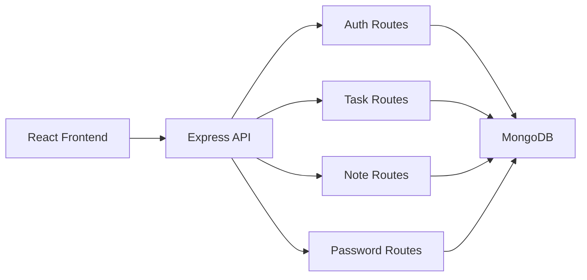

# Utilix

<p align="center">
  
</p>

<p align="center">
  <strong>An all-in-one productivity workspace built with React, Express, and MongoDB.</strong>
</p>

<p align="center">
  
  
  
  
</p>

## Overview

Utilix is a full-stack web application that combines multiple productivity tools into a single platform using React, Express, and MongoDB.

## Feature Showcase

| Module | What it does |
| ------ | ------------ |
| `DoTrack` | Create, list, complete, and delete personal tasks with optional dates and times |
| `NoteStack` | Save categorized notes and filter them by category |
| `SafeKeys` | Store credentials and generate passwords |
| `API Lab` | Send GET, POST, PUT, and DELETE requests |
| `KeySprint` | Practice typing speed and accuracy |
| `Auth Flow` | User signup, login, and protected routes |

## Tech Stack

### Frontend

- React 19
- React Router
- Vite

### Backend

- Node.js
- Express
- MongoDB
- Mongoose
- bcrypt

## Architecture At A Glance



## Project Structure

```text
Utilix/
|- frontend/   # React + Vite client
|- backend/    # Express + MongoDB API
|- README.md
```

### Frontend Pages

- `/` home page
- `/signin` user signin
- `/signup` user signup
- `/dashboard` tools dashboard
- `/dotrack` task manager
- `/notestack` notes manager
- `/safekeys` credential manager
- `/apilab` API tester
- `/keysprint` typing practice
- `/about` about page
- `/contact` contact page

### Backend API Groups

- `/api/auth` authentication routes
- `/api/tasks` task CRUD routes
- `/api/notes` note CRUD routes
- `/api/passwords` password CRUD routes

## Authentication

On successful signin, the backend returns a signed token containing the user's id, email, and name. The frontend stores this token in `localStorage` and sends it as a `Bearer` token to protected routes such as tasks, notes, and passwords.

## Local Development Setup

### Prerequisites

- Node.js and npm
- MongoDB running locally on `mongodb://127.0.0.1:27017/utilix`

### 1. Install dependencies

```bash
cd backend
npm install
```

```bash
cd frontend
npm install
```

### 2. Start the backend

```bash
cd backend
node server.js
```

The API runs on `http://localhost:5000`.

### 3. Start the frontend

```bash
cd frontend
npm run dev
```

Vite usually starts on `http://localhost:5173`.

## Environment Notes

The backend currently uses:

- MongoDB URL: `mongodb://127.0.0.1:27017/utilix`

Example:

```bash
AUTH_SECRET=replace-this-in-production
```

On Windows PowerShell:

```powershell
$env:AUTH_SECRET="replace-this-in-production"
node server.js
```

## API Overview

### Auth

- `POST /api/auth/signup`
- `POST /api/auth/signin`

### Tasks

- `GET /api/tasks`
- `POST /api/tasks`
- `DELETE /api/tasks/:id`

### Notes

- `GET /api/notes`
- `POST /api/notes`
- `DELETE /api/notes/:id`

### Passwords

- `GET /api/passwords`
- `POST /api/passwords`
- `DELETE /api/passwords/:id`

Protected routes require:

```http
Authorization: Bearer <token>
```

## Current Development Notes

- The frontend currently calls the backend with hardcoded `http://localhost:5000` URLs.
- There is no shared root script yet for running frontend and backend together.

## Author

Vighnesh Bhor
